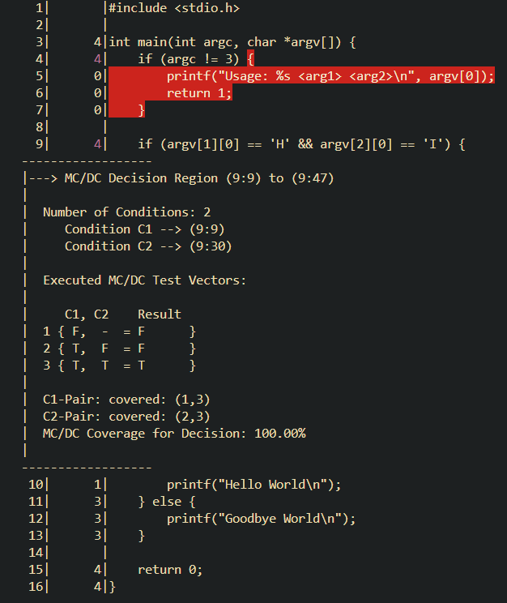

# How to Measure MCDC coverage with clang-19

## Simple Example Code ``example.c``
```
#include <stdio.h>

int main(int argc, char *argv[]) {
    if (argc != 3) {
        printf("Usage: %s <arg1> <arg2>\n", argv[0]);
        return 1;
    }

    if (argv[1][0] == 'H' && argv[2][0] == 'I') {
        printf("Hello World\n");
    } else {
        printf("Goodbye World\n");
    }

    return 0;
}
```

## Step1: Compile source file with clang-19 and coverage options
* command:
    ```
    $ clang-19 -fprofile-instr-generate -fcoverage-mapping -fcoverage-mcdc example.c -o example
    ```
    * result: confirm that executable file, ``example`` is succesfully generated

## Step2: Run instrumented executable file
* command:
    ```
    $ LLVM_PROFILE_FILE="run<cnt>.profraw" ./example H I
    ```
    * result: confirm the raw coverage file, ``run<cnt>.profraw`` file is succesfully generated
* example:
    ```
    $ LLVM_PROFILE_FILE="run1.profraw" ./example H I
    $ LLVM_PROFILE_FILE="run2.profraw" ./example H X
    $ LLVM_PROFILE_FILE="run3.profraw" ./example X I
    $ LLVM_PROFILE_FILE="run4.profraw" ./example X X
    ```

## Step3: Merge accumulated ``*.profraw`` file to single ``*.profdata`` file

* merge all ``run<cnt>.profraw`` raw files to a ``total-runs.profdata`` file to accumulate all past run coverages:
    ```
    $ llvm-profdata-19 merge run1.profraw run2.profraw run3.profraw run4.profraw -o total-runs.profdata
    ```
    * result: confirm that ``total-runs.profdata`` file has been succesfully generated

## Step4: Generate coverage report
1. **output to terminal**: use ``llvm-cov-19`` to show MC/DC coverage in terminal:
    ```
    $ llvm-cov-19 show ./example -instr-profile=total-runs.profdata --show-mcdc
    ```
    * screenshot result: 
        

2. **coverage percentage report to terminal**: use ``llvm-cov-19`` to report MC/DC coverage percentage in terminal:
    ```
    $ llvm-cov-19 report ./example -instr-profile=total-runs.profdata --show-mcdc-summary
    ```
    * screenshot result:
        

3. **output to html file**: use ``llvm-cov-19`` to report MC/DC coverage in html form:
    ```
    $ llvm-cov-19 show --show-mcdc ./example -instr-profile=total-runs.profdata -format=html > coverage.html
    ```
    * screenshot result:
        

